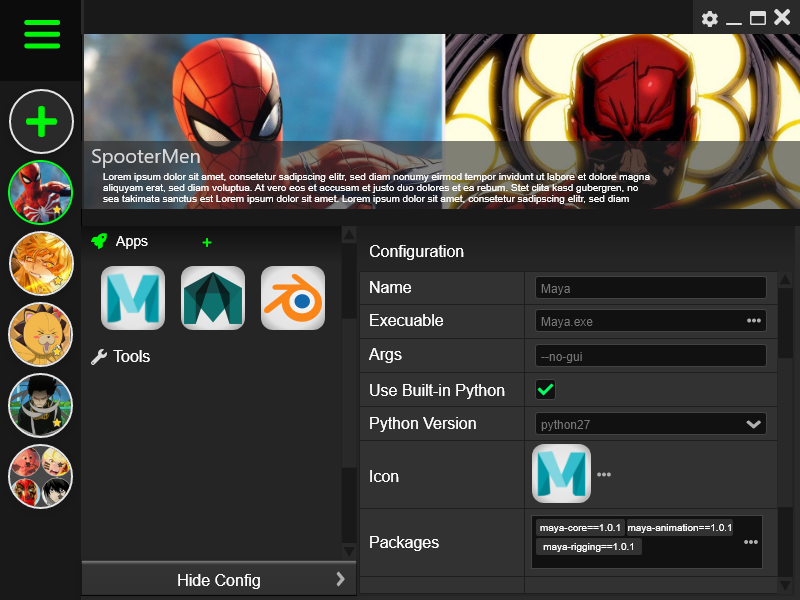
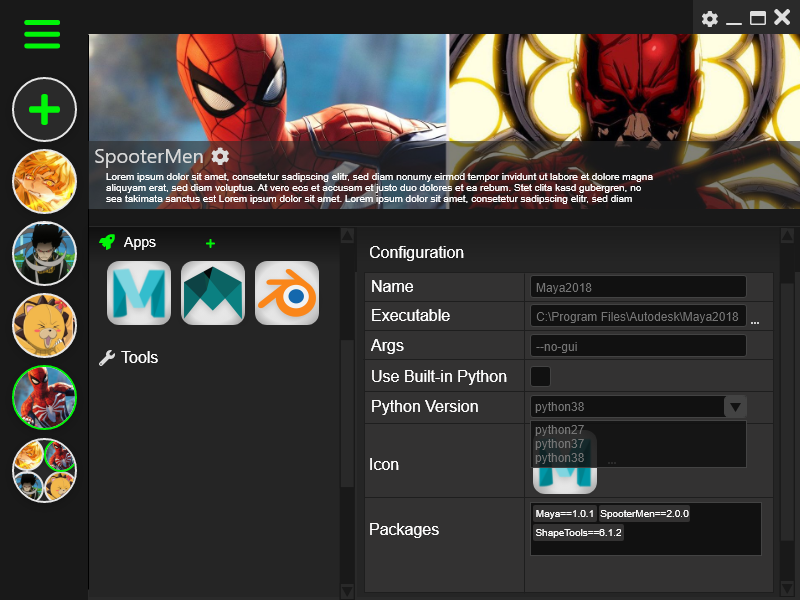
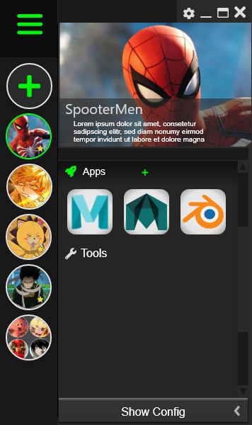
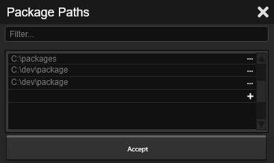
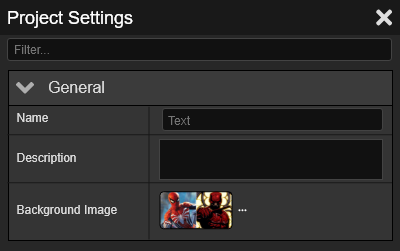
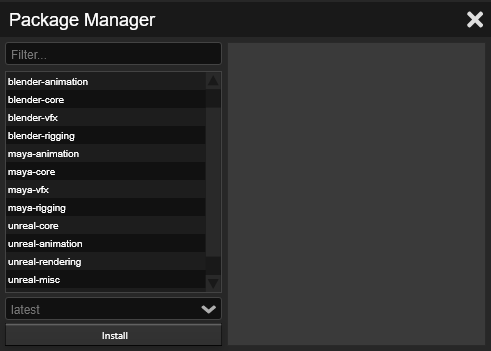
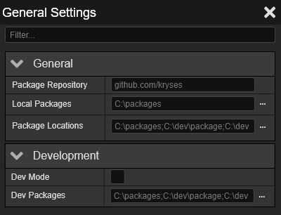

#KrysEvn

KrysEnv is a front end to help manage rez packages for use in content
creation using various applications. The goal is to be able to swap your 
applications to use different toolset per project with minimal effort. The tool will
also be equip with package management from different sources including local 
and shared locations as well as automatically pulling down packages from git repositories.

###Design

